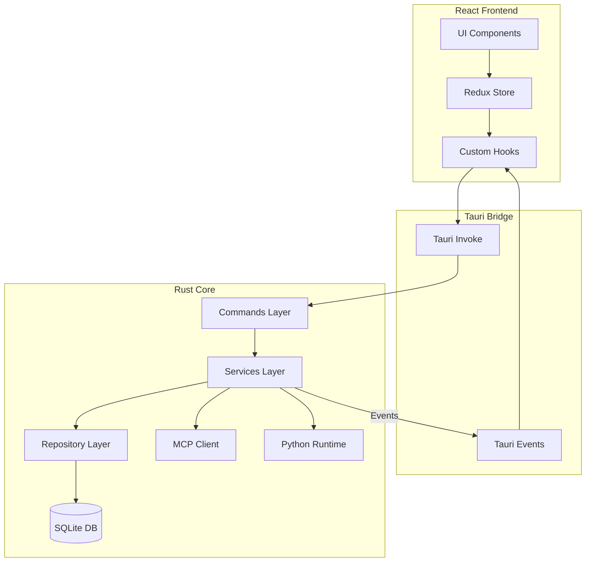

# System Architecture

## High-Level Overview

Nexo follows a **local-first, hybrid architecture** combining a React frontend with a Rust backend, communicating via the Tauri Inter-Process Communication (IPC) bridge.



## Data Flow Patterns

### 1. Request/Response (Commands)

The primary method of communication is the Frontend invoking a Backend Command.

1.  **User Action**: User clicks "Send Message".
2.  **Frontend**: `useChat` hook calls `invoke('send_message', { ... })`.
3.  **Command**: `fn send_message` receives the payload.
4.  **Service**: `MessageService` validates logic, calls `LLMService`.
5.  **Repository**: `MessageRepository` saves the user message to SQLite.
6.  **Response**: Command returns `Result<Message, Error>` to frontend.

### 2. Streaming & Events

For long-running AI generation, we use events.

1.  **Frontend**: Subscribes to `message-stream` event.
2.  **Backend**: `LLMService` receives stream from Provider (OpenAI/Anthropic).
3.  **Event**: Backend emits `message-stream` event for each chunk.
4.  **Frontend**: Event listener updates Redux state, re-rendering the UI in real-time.

## Component Responsibilities

### Frontend (`src/`)

- **Presentation**: Rendering UI, handling user input.
- **State**: Managing temporary UI state and cached server data (Redux).
- **Routing**: Internal app navigation.

### UI Architecture (Atomic Design)

The frontend follows **Atomic Design principles** adapted for desktop applications:

```
src/ui/
├── atoms/          # Basic UI primitives (Button, Input, Select)
│                   # - No business logic
│                   # - No Tauri API calls
│                   # - Pure presentational
│
├── molecules/      # Composed UI elements (Dropdown, Dialog, SearchBox)
│                   # - Composed of atoms
│                   # - Minimal UI-only logic
│                   # - No Tauri API calls
│
├── organisms/      # Complex UI sections (Sidebar, MessageList, SettingsForm)
│                   # - Can use hooks, Redux, local state
│                   # - Can call Tauri APIs via hooks
│                   # - Organized by domain (chat/, settings/, workspace/, markdown/)
│
├── layouts/        # Layout structure definitions
│                   # - MainLayout: Root layout with TitleBar
│                   # - SettingsLayout: Settings page structure
│                   # - ChatLayout: Chat page structure
│
└── screens/        # Full screen compositions
                    # - ChatScreen: Composes ChatLayout + ChatSidebar + ChatArea
                    # - SettingsScreen: Composes SettingsLayout + settings organisms
                    # - WorkspaceSettingsScreen: Full workspace settings view
```

**Key Rules:**

- **Atoms/Molecules**: Must NOT call Tauri APIs or use Redux directly.
- **Organisms/Screens**: Can use Tauri APIs via hooks and Redux for state management.
- **Separation**: Business logic lives in hooks/services, not in UI components.

### Backend (`src-tauri/`)

- **Business Logic**: All core application logic lives here.
- **Persistence**: SQLite database management.
- **Integration**: Communicating with 3rd party APIs (LLMs) and MCP Servers.
- **Security**: Sandboxing file access and runtime execution.

## Critical Subsystems

### The Agentic Core

Nexo isn't just a chat app; it's an agentic platform.

- **MCP Integration**: Uses `rust-mcp-sdk` to discover and invoke tools.
- **Runtime Envs**: Manages isolated Python/Node environments for code execution tools.

### Database Schema

We use `rusqlite` with bundled SQLite. Migrations are strictly versioned.

- **Workspaces**: Isolated groups of chats/settings.
- **Chats**: Threads of conversation.
- **Messages**: Individual nodes in the conversation tree.
